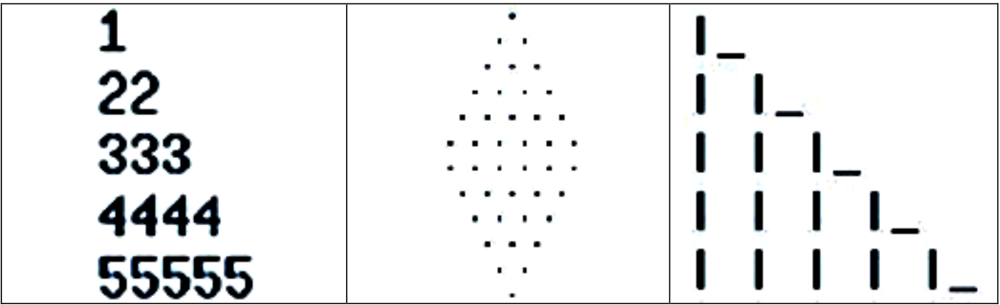

# Operating Systems Lab Assignments

This repository contains the assignments completed for the Operating Systems Laboratory course at Amirkabir University
of Technology, Tehran, during the Fall 2020 semester. The course focuses on core operating systems concepts like
processes, threads, scheduling, synchronization, deadlocks, and memory management.

The instructions for all assignments are in the [docs/instructions.pdf](docs/instructions.pdf) file (in Persian). Each
lab has its own directory containing the code/scripts and a PDF report (also in Persian).

## Assignments

### 1. Linux Introduction

- File and directory permissions are modified using `chown`, `chgrp`, and `chmod`. A test directory is created on the
  desktop and its permissions are configured. The groups that the current user belongs to are listed.

- The `chmod 4664 file.txt` command is explained - it sets read, write and execute permissions for owner and read
  permission for group and others.

- All empty files in a directory are deleted using a single `find` command with filters.

### 2. Kernel Module Programming

- A simple "Hello World" Linux kernel module is created in C. It is added to the kernel using `insmod` and then removed
  using `rmmod`.
- A linked list is implemented using the kernel's list data structure. Custom node structs are created, added to the
  list, and iterated over. The list is moved to the kernel messaging buffer using `printk()` and verified by
  checking `dmesg`
  output. Memory is freed and the list deleted properly on module exit.

### 3. Bash Scripting

The following bash scripts are created:

- [Q1.sh](Q1.sh): Gets two integer arguments, prints their sum, the larger value, and appropriate error for invalid
  inputs.

- [Q2.sh](Q2.sh): A calculator supporting basic math operations using `case`.

- [Q3.sh](Q3.sh): Continuously gets a number from the user, prints its reversed and the sum of its digits.

- [Q4.sh](Q4.sh): Prints specified lines from a file based on input arguments.

- [Q5.sh](Q5.sh): Prints some ascii art images. (Figure below)

- [Q6.sh](Q6.sh): A calculator for real numbers with functions, arguments, return values.



### 4. Inter-process Communication: Chat Server

A client-server chat application is built in C using inter-process communication via shared memory.

The multithread-server is started by:

```
server [port] 
```

The client is started by:

```
client [server_host] [server_port] [username]
```

The following client commands are implemented:

- `join [group_id]` - Join a group
- `send [group_id] [message]` - Send a message to a group
- `leave [group_id]` - Leave a group
- `quit` - Disconnect from server


In addition, two processes are created that communicate via two pipelines. One process sends a string, the other
converts casing (lower to upper, upper to lower) and sends it back. For example the string "This is First Process" is
sent and "tHIS iS fIRST pROCESS" is returned.

### 5. Threads and Processes: Normal Distribution

The goal of this assignment is to generate a normal distribution of random numbers using multiple processes.
First, an array named `hist` of 25 bins from -12 to 12 is created to hold the distribution. A counter variable is
initialized to 0.
In each iteration, a random number between 0-100 is generated. If the number is above 49, the counter is incremented
by1. If below 49, the counter is decremented by 1. This is repeated for 12 iterations. After the iterations, the array
bin corresponding to the counter's value is incremented by 1. This final values of the `hist` array represent a sample
from the normal distribution.

- The above is first implemented serially using a for loop to generate many samples.
- It is then parallelized by using `fork()` and `exec()` to create multiple child processes. The parent coordinates the
  children and combines their results.

Each child process works on its own local private copy of the histogram array. When finished, the parent process reads
each child's result and aggregates it into its own array. Race conditions are avoided because the processes do not share
the same array.

The parallel version runs much faster than the serial version, demonstrating the benefits of multiprocessing for
repetitive tasks.


### 6. Thread Synchronization: Dining Philosophers and Reader-Writer

This assignment focuses on two concurrency problems:

#### Reader-Writer Problem

The reader-writer problem models a scenario where multiple threads access a shared resource (like a file or database).
This problem is modeled with threads and shared memory as below.

- Reader threads - Read the current value of the shared memory, and print it out alongside their PID.
- Writer thread - Reads, increments by one, and then prints the value of memory by one alongside its PID.

By observing the program output when running the reader and writer threads concurrently, we would expect the value of
the shared variable to always increment upwards. However, we see it sometimes decreases unexpectedly. This happens
because of unsynchronized reads and writes to the shared variable.

</img>

To synchronize access, semaphores are used:

- A binary semaphore for writers - this ensures only one writer at a time.
- A counting semaphore for readers - this allows multiple simultaneous readers.

The writers acquire the writer semaphore before updating the variable, and release it afterwards. Readers acquire the
reader semaphore, read the variable, and release the semaphore. This approach resolves race conditions and demonstrates
a classic solution to the reader-writer problem using
semaphores.

| Writer                                    | Reader                                    |
|-------------------------------------------|-------------------------------------------|
|  |  |

#### Dining Philosophers

The dining philosophers problem models resource allocation between processes.

5 philosophers are sitting at a table with a bowl of rice. There is one chopstick between each philosopher. To eat, a
philosopher needs two chopsticks. The philosophers alternate between eating and thinking.

The solutions prevents deadlock and starvation using mutex locks and condition variables in C. Each chopstick has a
mutex lock. To pick up a chopstick, the philosopher locks the mutex. After picking up both chopsticks, they can eat.
After eating, they put down the chopsticks by unlocking the mutexes.

If a philosopher tries to pick up a second chopstick that is already in use, they wait on a condition variable until the
chopstick is available again. This prevents deadlock. The solution also prevents starvation by tracking which
philosophers are currently eating. Sample output can be seen below:


### 7. Deadlocks: Banker's Algorithm

The banker's algorithm manages allocation of limited resources to processes to avoid deadlock.

There are multiple processes requesting and releasing shared resources like printers, CPU time etc. If not managed
properly, the system can reach a deadlocked state where no process can proceed.

The banker's algorithm uses:

- Available array - Total amount of each resource currently available
- Max matrix - Maximum demand of each process
- Allocation matrix - Current allocation to each process
- Need matrix - Additional resources each process may request

When a process requests resources, the algorithm checks if the request can be satisfied while still leaving the system
in a safe state. The request is only granted if it is "safe" to avoid deadlock. The program implements this algorithm
with threads representing processes requesting and releasing resources. The
resource allocation logic is synchronized to avoid race conditions.

Sample output can be found in the [report](labs/lab_7/report.pdf).

## Course Information

- **Course**: Operating Systems
- **University**: Amirkabir University of Technology
- **Semester**: Fall 2020

Let me know if you have any questions!

## Credits

The codes here are solely written by the repository owner. The readme is written by translating the `instructions.pdf`
solely by the repository owner, and then is summarized with the help of Anthropic's Claude.

[](https://opensource.org/licenses/MIT)